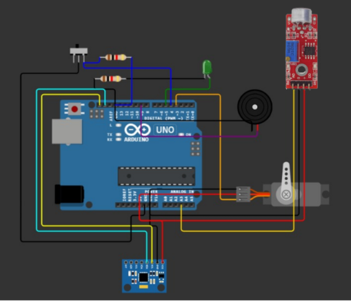

## Description
This Project is used to transform the way of controling any game can be played by just one key on the keyboard (or mouse)
to be controlled with hand mouvement or sound command 
## Hardware
- Arduino (any type)
- MPU
- Servo (you can also control using the serial protocol via USB) => for USB mode check the the other branch of this repo
- Microphone Module (any digital output module)
- Switch
## Wiring diagram

